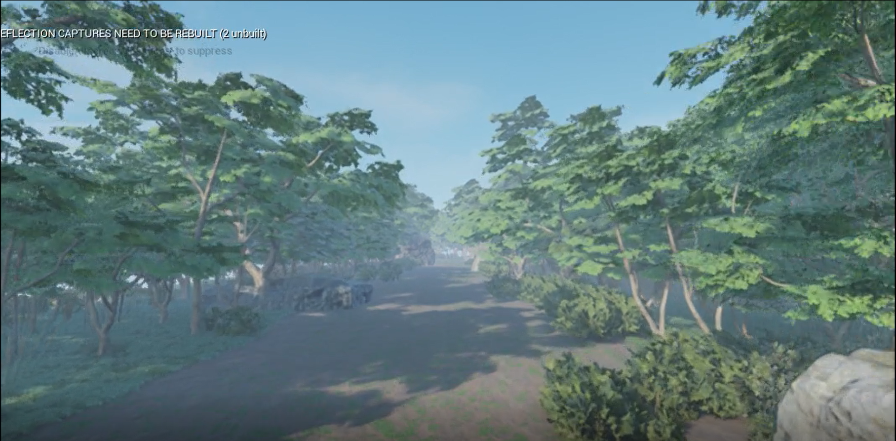

# Semantic Segmentation for UAV autodriving in the forest trail
2020 Summer/Fall KAIST URP Program
with Prof.SungjuHwang (MLAI lab, Graduate School of AI in KAIST)

# Abstract
I made a real-time semantic segmentation model for auto-driving in a forest trail. To train the semantic segmentation model, image and segmentation
label pairs are required, however, ther were few segmentation data for a forest trail. So I mad a simulated forest environment using Unreal Engine and get data
pairs with Airsim plugin. I trained ICNet with my forest trail dataset, but there was a domain gap between simulation and the real world. Thus I applied CYCADA for domain adaptation.

Please check my report. [link](https://drive.google.com/file/d/1HJocZcdSeYmASQho2Do9TqUVwdKcKnIU/view?usp=sharing)

# Forest trail maps made with Unreal Engine
You can download forest trail maps in this [link](https://drive.google.com/drive/folders/12WXLuPHHWLbfuAhG6QTGvS4GEC1UA9C-?usp=sharing).
Also you can see the video of one map in this [Youtube link](https://www.youtube.com/watch?v=IBE_9HmYDIk&ab_channel=AntabodyKAIST).
Maps need various types of tree style, those are I used which are all in the UE marketplace.
* EssentialTreeKit
* Season_trees_VOL1
* Tropical_Jungle_Pack

# ICNet
I adapted ICNet to forest trail dataset. There are 5 classes: sky(#37b539), tree(#977eab), grass(#e8fa50), rock(#115bed), and ground(#bb469c). You can download pretrained model in this [link](https://drive.google.com/drive/folders/1ztdfK7ipF8yrvuTdXQKShOmiGoF3LSGc?usp=sharing). Base codes are from [@liminn/ICNet-pytorch](https://github.com/liminn/ICNet-pytorch).

# CYCADA
I used [@jhoffman/cycada_release](https://github.com/jhoffman/cycada_release) for domain adaptation between UE map and real world. In this [link](https://drive.google.com/drive/folders/1oWULfUJIBxucURe1E7VjUjHbzlZaZHIG?usp=sharing), there are datasets for Cycle-GAN stage and you can download pretrained models for ADDA stage in this [link](https://drive.google.com/drive/folders/1-SNGA4TVDaxPdSA6xelVX2QHCxpNx9jJ?usp=sharing). 

